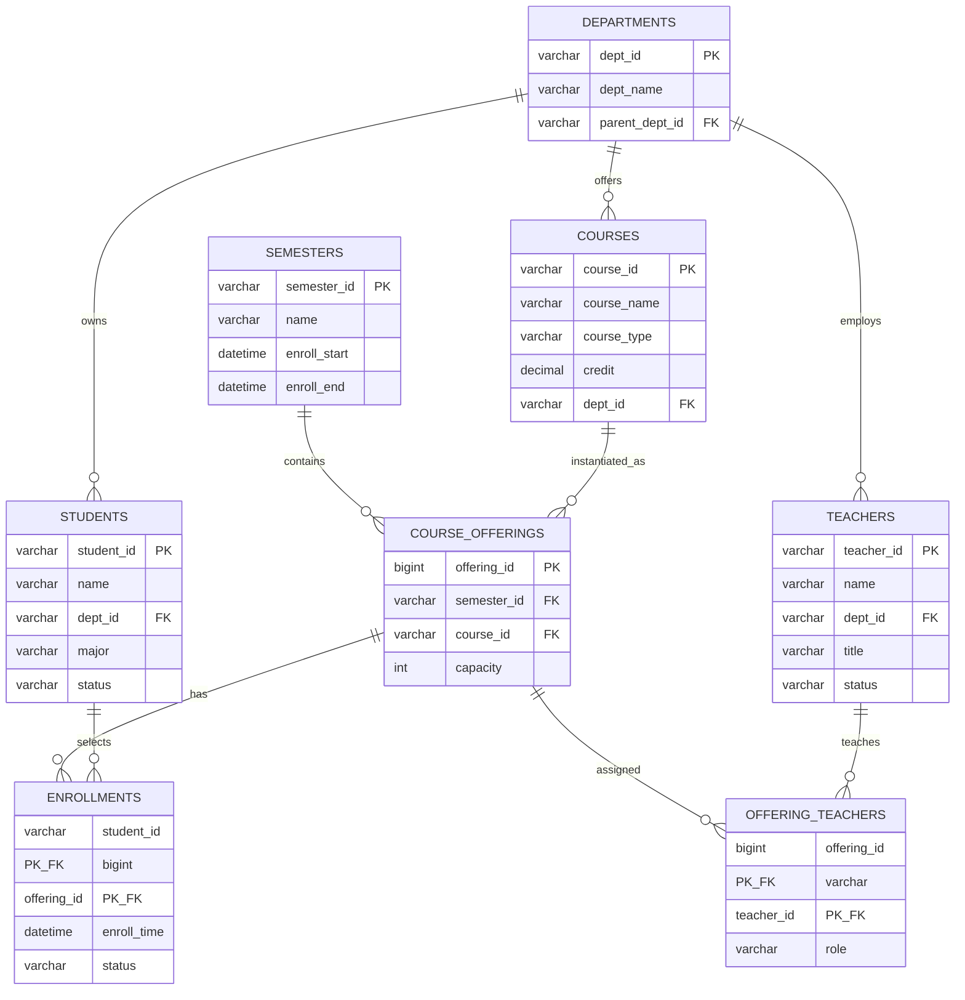

# 高校选课系统 — 核心数据模型、并发与索引设计说明

本文档对应课程/作业中的「分析及设计」要求，聚焦三件事：**核心数据模型（含教师表与多表关联）**、**选课高峰期并发风险与对策**、**选课记录表与课程表的索引设计**。可作为数据库建模评审或答辩附件使用。

---

## 一、核心数据模型

### 1.1 设计原则

- **主键可读性与稳定性**：业务主键（学号、工号、课号）与无意义代理主键（`BIGINT`）可二选一；下文采用 **业务主键 / 自然键** 便于与题目中的 `S000001`、`C000001` 风格对齐，生产环境可再增加 `id BIGINT` 作为内部主键。  
- **多对多拆表**：教师与课程、学生与课程（选课）均通过 **中间事实表** 表达，避免在单表上硬编码多值字段。  
- **时间轴与学期**：选课、开课均挂在 **学期** 维度，避免跨学期数据混统计。

### 1.2 实体一览（不限于题目中的三张表）

| 实体 | 表名（建议） | 作用 |
|------|--------------|------|
| 院系 | `departments` | 组织维度，学生/教师归属 |
| 学生 | `students` | 学籍与账号维度 |
| 教师 | `teachers` | 人事与授课资质 |
| 课程（培养方案中的课） | `courses` | 课程元数据（名称、类型、学分、容量等） |
| 学期 | `semesters` | 学年学期、选课窗口 |
| 开课班（教学班） | `course_offerings` | 某学期某门课的具体开班（容量、上课时间可挂在此） |
| 教师授课 | `offering_teachers` | 开课班与教师（主讲/辅导） |
| 选课记录 | `enrollments` | 学生对某开课班的选课事实 |
| 操作审计（可选） | `enrollment_audit_logs` | 退选、失败原因、幂等请求号 |

### 1.3 各表字段建议

#### 1.3.1 院系表 `departments`

| 字段名 | 类型 | 约束 | 说明 |
|--------|------|------|------|
| `dept_id` | `VARCHAR(20)` | PK | 院系编码 |
| `dept_name` | `VARCHAR(100)` | NOT NULL | 院系名称 |
| `parent_dept_id` | `VARCHAR(20)` | FK → `departments` | 上级院系，可空 |

#### 1.3.2 学生表 `students`（完善后）

| 字段名 | 类型 | 约束 | 说明 |
|--------|------|------|------|
| `student_id` | `VARCHAR(20)` | PK | 学号，如 `S000001` |
| `name` | `VARCHAR(50)` | NOT NULL | 姓名 |
| `dept_id` | `VARCHAR(20)` | FK → `departments` | 所属院系 |
| `major` | `VARCHAR(80)` | | 专业 |
| `grade` | `CHAR(4)` | | 年级（入学年） |
| `status` | `TINYINT` / `VARCHAR(20)` | NOT NULL | 在读/休学/毕业等 |
| `phone` | `VARCHAR(20)` | | 联系方式 |
| `created_at` | `DATETIME` | NOT NULL | 建档时间 |
| `updated_at` | `DATETIME` | NOT NULL | 更新时间 |

#### 1.3.3 教师表 `teachers`（补充）

| 字段名 | 类型 | 约束 | 说明 |
|--------|------|------|------|
| `teacher_id` | `VARCHAR(20)` | PK | 工号 |
| `name` | `VARCHAR(50)` | NOT NULL | 姓名 |
| `dept_id` | `VARCHAR(20)` | FK → `departments` | 所属院系 |
| `title` | `VARCHAR(30)` | | 职称：讲师/副教授/教授等 |
| `hire_date` | `DATE` | | 入职日期 |
| `status` | `VARCHAR(20)` | NOT NULL | 在职/离职 |
| `created_at` / `updated_at` | `DATETIME` | | 审计字段 |

#### 1.3.4 课程表 `courses`（完善后）

| 字段名 | 类型 | 约束 | 说明 |
|--------|------|------|------|
| `course_id` | `VARCHAR(20)` | PK | 课程编码 |
| `course_name` | `VARCHAR(100)` | NOT NULL | 课程名称 |
| `course_type` | `VARCHAR(20)` | NOT NULL | 公共课/专业课/选修课等 |
| `credit` | `DECIMAL(3,1)` | NOT NULL | 学分 |
| `default_capacity` | `INT` | | 默认容量（可被开课班覆盖） |
| `dept_id` | `VARCHAR(20)` | FK | 开课院系（课程归属） |
| `description` | `TEXT` | | 简介 |
| `created_at` / `updated_at` | `DATETIME` | | 审计字段 |

> 说明：**容量**既可只在 `course_offerings` 上维护（更贴近「每学期每班名额不同」），也可在 `courses` 保留 `default_capacity` 作为模板默认值。

#### 1.3.5 学期表 `semesters`

| 字段名 | 类型 | 约束 | 说明 |
|--------|------|------|------|
| `semester_id` | `VARCHAR(20)` | PK | 如 `2025-2026-1` |
| `name` | `VARCHAR(50)` | NOT NULL | 显示名 |
| `enroll_start` / `enroll_end` | `DATETIME` | | 选课开放窗口 |

#### 1.3.6 开课班表 `course_offerings`

| 字段名 | 类型 | 约束 | 说明 |
|--------|------|------|------|
| `offering_id` | `BIGINT` | PK，自增 | 教学班内部主键 |
| `semester_id` | `VARCHAR(20)` | FK → `semesters` | 学期 |
| `course_id` | `VARCHAR(20)` | FK → `courses` | 课程 |
| `capacity` | `INT` | NOT NULL | 本班容量 |
| `schedule_text` | `VARCHAR(200)` | | 上课时间地点摘要 |
| `status` | `VARCHAR(20)` | | 开课/停课 |

#### 1.3.7 教师授课表 `offering_teachers`

| 字段名 | 类型 | 约束 | 说明 |
|--------|------|------|------|
| `offering_id` | `BIGINT` | PK, FK | 开课班 |
| `teacher_id` | `VARCHAR(20)` | PK, FK | 教师 |
| `role` | `VARCHAR(20)` | NOT NULL | 主讲/辅导 |

#### 1.3.8 选课记录表 `enrollments`（完善后）

若采用「学生对开课班选课」模型（推荐）：

| 字段名 | 类型 | 约束 | 说明 |
|--------|------|------|------|
| `student_id` | `VARCHAR(20)` | PK 之一, FK | 学生 |
| `offering_id` | `BIGINT` | PK 之一, FK | 开课班（隐含学期+课程） |
| `enroll_time` | `DATETIME` | NOT NULL | 选课成功时间 |
| `status` | `VARCHAR(20)` | NOT NULL | 已选/已退/待审核等 |
| `drop_time` | `DATETIME` | | 退选时间 |

若沿用题目中的「学生对课程」简化模型（无开课班）：

| 字段名 | 类型 | 约束 | 说明 |
|--------|------|------|------|
| `student_id` | `VARCHAR(20)` | PK 之一 | 学生 |
| `course_id` | `VARCHAR(20)` | PK 之一 | 课程 |
| `enroll_time` | `DATETIME` | NOT NULL | 选课时间 |
| `semester_id` | `VARCHAR(20)` | FK，建议 NOT NULL | 避免跨学期唯一性混乱 |

下文 **索引设计** 同时覆盖「简化版 `(student_id, course_id)`」与「推荐版 `(student_id, offering_id)`」两种主键形态的思路。

### 1.4 表间关联关系（文字说明）

1. **院系 `departments`**：一对多指向 **学生**、**教师**、**课程**（归属院系）。  
2. **课程 `courses`**：与 **学期 + 开课班 `course_offerings`** 为一对多；同一课程在不同学期可有多个班。  
3. **开课班 `course_offerings`**：多对多连接 **教师**（通过 **`offering_teachers`**）；一对多连接 **选课记录 `enrollments`**（每行表示一名学生选中了该班）。  
4. **学生 `students`**：通过 **`enrollments`** 与 **开课班**（或简化模型下与 **课程**）多对多。  
5. **教师 `teachers`**：仅通过 **`offering_teachers`** 与具体教学班关联，避免在 `courses` 上直接写死「唯一教师」（团队课、换教师更灵活）。

### 1.5 ER 图（逻辑模型）

下图以 **开课班 + 选课** 为推荐模型；若去掉 `course_offerings` / `offering_teachers`，将 `enrollments` 直接连到 `courses` 即退化为题目简版。

---

## 二、选课高峰期的并发风险与解决方案

### 2.1 核心并发问题（现象与根因）

在抢选热门课或容量余量很少时，典型流程为：

1. 应用查询当前选课人数或剩余名额；  
2. 判断「未满」后插入 `enrollments`；  

若步骤 1 与 2 **不在同一事务的同一锁粒度下完成**，多个请求可能同时读到「尚有余量」，导致 **超选（实际人数 > 容量）**。  
另一类问题是 **重复提交**：用户连点、重试、多 Tab，可能插入重复选课行，破坏「同一学生对同一教学班只能选一次」的唯一性。

### 2.2 一个简单可行的解决方案（推荐组合）

**方案：数据库唯一约束 + 事务内锁定开课班（或课程行）后再次校验容量并插入**

1. **唯一约束**  
   - 简化模型：`(student_id, course_id, semester_id)` 唯一（若每学期每课只能选一次）。  
   - 推荐模型：`(student_id, offering_id)` 唯一。  
   这样从数据层杜绝重复选课。

2. **单事务 + 行级锁控制余量**（以 InnoDB 为例）  
   - 事务开始；  
   - `SELECT capacity FROM course_offerings WHERE offering_id = ? FOR UPDATE;`（锁定该开班行）  
   - 在同一事务内 `SELECT COUNT(*) FROM enrollments WHERE offering_id = ? AND status='已选'`（或与 `FOR UPDATE` 一致的统计方式）；  
   - 若 `count < capacity` 则 `INSERT INTO enrollments ...`；否则回滚并返回「名额已满」。  
   - 提交事务。

**为何简单可行**：不依赖额外中间件；锁粒度仅为「某一开课班一行」，冲突面小于全表锁；与唯一约束配合可同时解决 **超选** 与 **重复插入选课**。

**可选增强（仍较简单）**：对「余量」使用 **乐观锁**（`course_offerings` 增加 `version`，`UPDATE ... WHERE version = ? AND count < capacity`），适合冲突略低的场景；高峰期仍以 **悲观锁（FOR UPDATE）** 更直观。

---

## 三、索引设计（选课记录表、课程表）

以下默认 **MySQL InnoDB**（二级索引为 B-Tree）。若使用 PostgreSQL，思路一致：B-Tree 用于等值与范围，`UNIQUE` 索引同时承担约束。

### 3.1 选课记录表 `enrollments`

| 索引名（建议） | 索引类型 | 列 | 设计理由 |
|----------------|----------|-----|----------|
| `PRIMARY` | 聚簇索引 / 主键 | `(student_id, offering_id)` 或题目简版 `(student_id, course_id)` | 主键即最常用的「按学生查课表」访问路径之一；聚簇索引叶子存整行，减少回表。 |
| `idx_enroll_offering` | 二级索引（B-Tree） | `(offering_id)` 或简版 `(course_id)` | **按课统计人数**、与 `courses` 做 JOIN、题目中的「每门课选课人数」均高频按课维度聚合，避免全表扫描。 |
| `idx_enroll_time` | 二级索引（B-Tree） | `(enroll_time)` 或 `(offering_id, enroll_time)` | 运营与审计按时间范围查询；若常查「某班最近一段时间选课」，复合 `(offering_id, enroll_time)` 更贴合。 |
| `UNIQUE`（已由业务保证时可与主键合并） | 唯一 B-Tree | 见上文唯一键 | 防止重复选课，插入冲突可直接映射为业务错误码。 |

**类型说明**：InnoDB 中除主键外的索引均为 **二级索引**，底层一般为 **B-Tree**；是否为 **唯一索引** 由业务唯一性决定。

### 3.2 课程表 `courses`

| 索引名（建议） | 索引类型 | 列 | 设计理由 |
|----------------|----------|-----|----------|
| `PRIMARY` | 聚簇索引 | `(course_id)` | 主键查找、与 `enrollments` / `course_offerings` 外键关联。 |
| `idx_course_type` | 二级索引（B-Tree） | `(course_type)` | 题目中「统计专业课」「按课程类型筛选」类查询；选择性低时可与 `dept_id` 组成复合索引视数据分布而定。 |
| `idx_course_dept` | 二级索引（B-Tree） | `(dept_id)` | 按院系维护课程列表、院系维度统计。 |
| `idx_course_name` | 二级索引（B-Tree） | `(course_name)` 或前缀索引 | 管理端按名称模糊搜索；中文场景若前缀索引效果差，可配合全文检索或搜索引擎，本说明仍给出关系库侧常规方案。 |

### 3.3 与 SQL 题目的关系

作业中「按课程统计人数」的 SQL，在 `enrollments.course_id` 上具备二级索引时，**GROUP BY / JOIN** 更易走索引；`courses.course_type` 上的索引有利于 **WHERE course_type = '专业课'** 过滤（是否选用需结合实际基数，数据量较小时优化器可能选择全表扫描，索引仍利于扩展与规范）。

---

## 四、文档维护说明

| 版本 | 日期 | 变更摘要 |
|------|------|----------|
| 1.0 | 2026-05-14 | 初稿：数据模型、ER 图、并发方案、索引说明 |

若课程要求强制「选课记录仅含 student_id + course_id」而无 `semester_id`，务必在文档与实现中明确 **「每学期重置或沿用全局唯一」** 的规则，并在唯一索引中包含 `semester_id` 或接受跨学期不可重复的业务含义。

---

**文档路径**：`docs/高校选课系统-数据模型与数据库设计说明.md`
